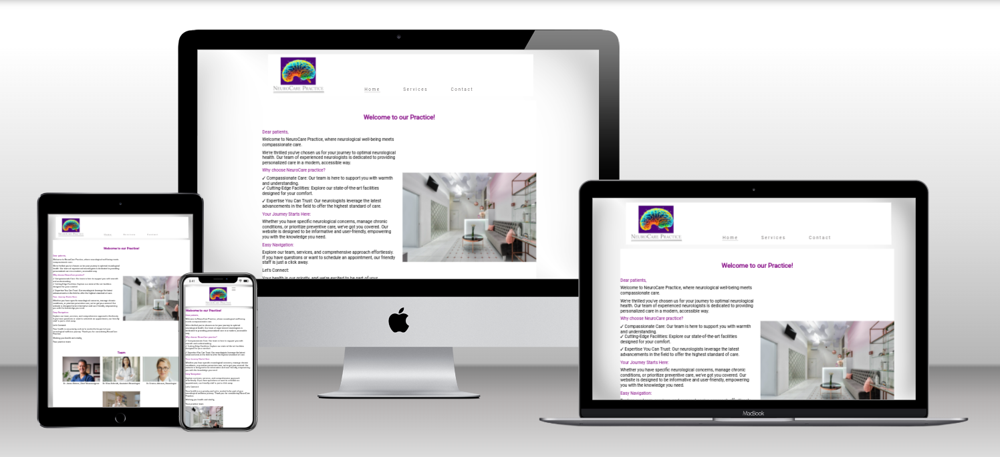
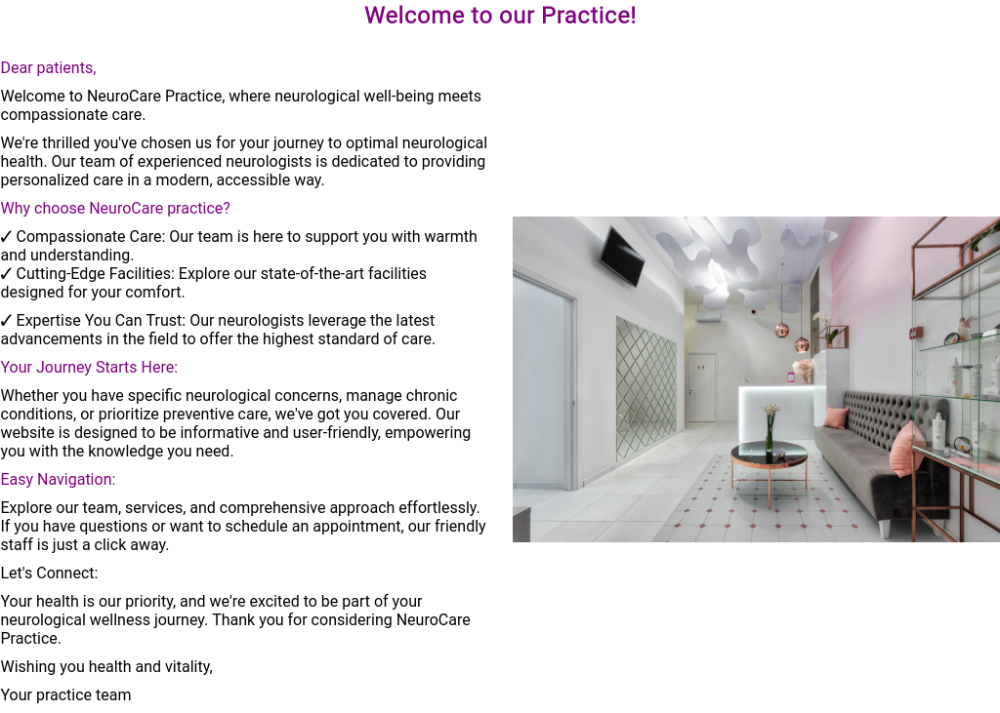
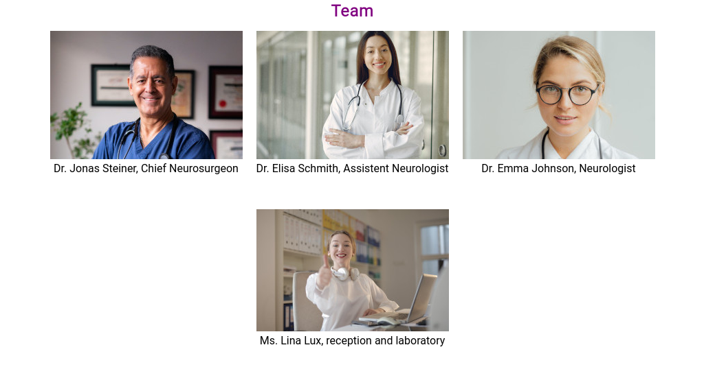
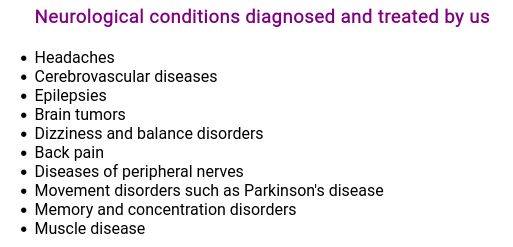
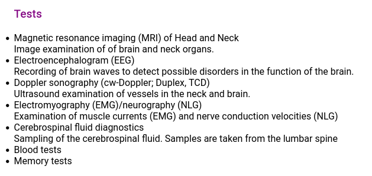
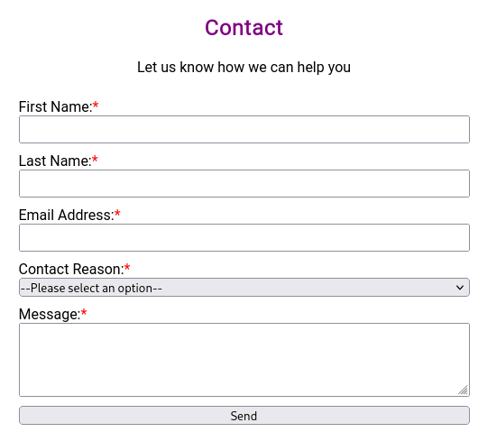
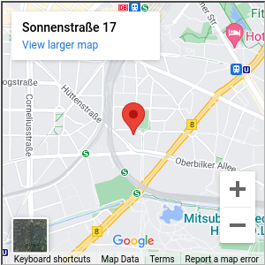
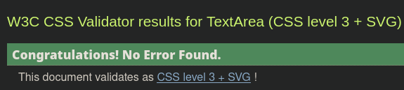

# NeuroCare Practice

Welcome to the GitHub repository for our NeuroCare Practice website! This project is dedicated to providing a comprehensive online platform for our neurology clinic, aiming to deliver valuable information, resources, and a user-friendly experience for our patients, caregivers, and the broader community.

  

 The live site can be found here: [NeuroCAre Practice](https://vega-2135.github.io/NeuroCare-Practice/)

## About Us

At NeuroCare Practice, we are committed to excellence in neurological care. Our team of experienced neurologists specializes in diagnosing and treating a wide range of neurological disorders. With a patient-centered approach, we strive to offer personalized care, cutting-edge treatments, and ongoing support.


## Table of content

1. [User Experience](#user-experience)
2. [Features](#features)
3. [Technologies Used](#technologies-used)
4. [Testing](#testing)
5. [Deployment](#deployment)
6. [Credits](#credits)

## User Experience

Welcome to the NeuroCare Practice website! Our platform is designed to provide a seamless and informative experience for users seeking neurology medical services. Here's a brief overview of the key aspects of your user experience:

### 1. **Intuitive Navigation:**

-   Our website features an intuitive and user-friendly navigation system, allowing visitors to easily find the information they need.
-   The menu is logically organized, ensuring a smooth journey through different sections, including home, services and contact information.

### 2. **Responsive Design:**

-   NeuroCare Practice is optimized for various devices, ensuring a consistent and visually appealing experience whether you're accessing the site from a desktop, tablet, or smartphone.

### 3. **Rich Content:**

-   We've curated comprehensive content to provide users with detailed insights into our neurology medical practice. From service offerings to images from our practice and personnel, you'll find everything you need to know.

### 4. **Performance:**

-   NeuroCare Practice prioritizes performance, ensuring fast load times and smooth interactions, creating a pleasant and efficient browsing experience for our visitors.

### 5. **Accessibility:**

-   We're committed to making our website accessible to all users. NeuroCare Practice complies with web accessibility standards, ensuring an inclusive experience for individuals with disabilities.

### How to Get Started:

1.  **Visit our website:** [NeuroCare Practice](https://vega-2135.github.io/NeuroCare-Practice/)
2.  **Explore our home, services and contact information.**
3.  **Provide feedback:** We value your input. If you encounter any issues or have suggestions for improvement, please contact us via email.

Thank you for choosing NeuroCare Practice. We strive to provide an excellent online experience to complement our exceptional medical services.

## Features

### 1. **Home Page**
   - **Description:**
     The Home Page serves as the virtual front door to our neurology practice, offering a warm welcome to both current and prospective patients. It is designed to create a sense of familiarity and trust by providing a glimpse into the practice environment and introducing the dedicated team of professionals.

      

      

     

   - **Key Components:**
     - **Welcoming Message:** A personalized greeting that conveys our commitment to quality care and patient well-being.
     - **Visual Tour:** Featuring images of our front desk, waiting area, and key areas of the practice, allowing visitors to virtually explore our clinic before their visit.
     - **Meet the Team Section:** Individual profiles and pictures of each member of our practice team, including neurologists, support staff, and administrative personnel. This fosters a connection and familiarity with the faces behind the care.
     - **News Section:** Stay informed with the latest updates about our practice, including changes in opening hours, the introduction of new therapies, and other relevant announcements.

   - **Benefits:**
     - **Patient Familiarization:** By showcasing our practice environment and team, we aim to make patients feel more comfortable and familiar before their visit.
     - **Transparent Communication:** The news section ensures that patients are promptly informed about any changes or developments, fostering transparent communication between the clinic and its community.
     - **Personal Connection:** Featuring the team's profiles helps establish a personal connection, allowing patients to get to know their healthcare providers in advance.

   - **Call to Action:**
     - Visitors are encouraged to explore the team profiles, read the latest news, and get acquainted with our practice environment. For new patients, the welcoming message sets the tone for a positive experience, emphasizing our dedication to compassionate and quality neurological care.
    
### 2. **Services Page**
   - **Description:**
     The Services Page provides comprehensive information about the medical conditions managed, diagnosed, and treated at our neurology practice. It also details the range of diagnostic tests and procedures available, reinforcing our commitment to delivering high-quality and specialized neurological care.

     

     

   - **Key Components:**
     - **Medical Conditions:** An exhaustive list of neurological conditions that our practice specializes in managing, diagnosing, and treating. From common issues to rare disorders, we outline our expertise to guide patients in understanding our scope of services.
     - **Diagnostic Tests:** A detailed overview of diagnostic tests conducted at our facility, including but not limited to Electroencephalogram (EEG), Doppler Sonography, and other essential neurological assessments. 
     - **Visual Representation:** 2 images, one capturing one of the diagnostic tests being performed and another of a Brain imaging test result, providing a visual insight into the procedures conducted at our practice.

   - **Benefits:**
     - **Informed Decision-Making:** By detailing the medical conditions and tests offered, patients can make informed decisions about their healthcare and understand how our practice addresses their specific needs.
     - **Transparency:** We aim to be transparent about the diagnostic tools we employ. Including an image adds a human touch and demystifies the testing process for patients.
     - **Specialized Expertise:** Highlighting our proficiency in managing a broad spectrum of neurological conditions reinforces our commitment to providing specialized and comprehensive care.

   - **Call to Action:**
     - Visitors are encouraged to explore the comprehensive list of medical conditions and diagnostic tests. This section empowers patients to take an active role in their healthcare journey, fostering a sense of trust in our specialized neurological services.

### 5. **Contact Page**
   - **Description:**
     The Contact Page serves as a direct line of communication between our neurology practice and patients. It features a versatile contact form that allows patients to inquire about their health, request appointments, or seek assistance. Additionally, essential contact information, including our exact location on a map, opening hours, telephone number, and email address, is provided for the convenience of our patients.

     
     
     

   - **Key Components:**
     - **Contact Form:** A user-friendly form that enables patients to submit inquiries, request appointments, or seek specific information. The form is designed to cater to the diverse needs of our patients, whether they have questions, want to schedule an appointment, or require assistance with prescription requests.
     - **Location Map:** An interactive map displaying the exact location of our practice. This visual aid makes it easy for patients to find us and plan their visit.
     - **Opening Hours:** Clear and concise information about our practice's opening hours, ensuring that patients are well-informed about when they can reach us.
     - **Contact Information:** Essential details such as our telephone number and email address are prominently displayed, offering multiple channels for patients to reach out.

   - **Benefits:**
     - **Convenient Communication:** The contact form streamlines communication, allowing patients to reach out for various purposes without the need for multiple points of contact.
     - **Location Clarity:** The interactive map enhances accessibility, ensuring that patients can easily locate our practice. Opening hours information further assists in planning visits.
     - **Responsive Support:** By providing multiple contact options, including a form, phone number, and email, we ensure that patients can choose the method that best suits their preferences.

   - **Call to Action:**
     - Patients are encouraged to utilize the contact form for inquiries, appointment requests, or any other information they may need. Additionally, they can refer to the map and contact details to plan their visit or seek assistance through the most convenient means.

## Additional Features

- **Header Logo:**  
  Present on every page, the logo serves as a recognizable symbol of our neurology medical practice. Clicking on the logo redirects users to the home page, ensuring a familiar and expected navigation experience.

  

- **Header Navigation Bar:**  
  Found on every page, the navigation bar facilitates easy navigation across the website, enabling users to quickly locate the information they seek about our neurology services.

  

- **Footer Social Icons:**  
  Accessible on every page, social icons in the footer provide users with a direct link to our clinic's social platforms, enhancing connectivity and engagement with our neurology community.

  

## Future Features

- **Telemedicine:** Explore our telemedicine services, allowing patients to consult with our neurologists from the comfort of their homes.
- **Patient Resources:** Access educational materials, articles, and FAQs to empower patients and their families with knowledge about neurological conditions.
 - **Enhanced Appointment Scheduling** We are excited to announce an upcoming enhancement to our appointment scheduling system. In collaboration with DoctorLib, a leading healthcare scheduling platform, we are working to implement a seamless and efficient appointment booking experience for our patients.

## Technologies used

- **GitHub:**  
  Version control platform used for collaborative development and code management.

- **GitPod:**  
  An online IDE (Integrated Development Environment) for easy and accessible coding.

- **Google Fonts:**  
  Used to import and apply a variety of fonts to enhance the visual appeal of the website.

- **Google Developer Tools:**  
  Integrated browser tools for debugging, profiling, and optimizing the website during development.

- **Favicon Generator:**  
  Tool used to generate a favicon, ensuring a customized and recognizable icon for the website.

- **Font Awesome:**  
  Icon toolkit providing a collection of scalable vector icons for a visually appealing design.

- **VSCode (Visual Studio Code):**  
  A lightweight and powerful code editor used for writing, editing, and debugging code efficiently.

- **Techsini:**
  Used to create mockup images of home page in different devices (phone, ipad, laptop, desktop).

- **DeepDream Generator:**  
  Utilized for generating unique and artistic images, such as those incorporated into the logo design.

- **Pexels:**  
  An online platform for high-quality stock photos, contributing to visually rich content on the website.

## Testing

### User Story Testing:

The website was tested to ensure the user story achieved the intended outcomes:

- **Home Section:**
  - Users have an informative welcome message.
  - On different devices, the home section displays relevant photos from the practice and the personnel.
  - Users are informed about currents events taking place in the practice.

- **Service Section:**
  - Uses are informed about the different medical conditions and diagnosis that are offered by the practice.

- **Footer:**
  - Social media profiles are accessible via icons in the footer.
  - Relevant contact information is provided in this section.

- **Contact Form:**
  - Error messages appear for invalid email addresses.
  - 'Required' attribute on all fields prevents submission if not filled.
  - Successful submission reloads the page.

- **Contacting Process:**
  - All fields in the form must be filled in order to contact the medical practice.

- **Link Behavior:**
  - All links open in a new tab using 'target="_blank."'
  - Manually tested to ensure all links point to the correct destinations.

### Cross-Browser and Device Testing:

The NeuroCare Practice website underwent thorough testing across multiple browsers and devices to ensure compatibility and responsiveness:

- **Browsers:**
  - Chrome, Safari, Internet Explorer, Firefox.

- **Mobile Devices:**
  - iPhone 4, 5, 7 (Chrome and Safari).
  - iPad.
  - Samsung Galaxy Fold.
 
### HTL Code Validation:
 The W3C Markup Validation Service was used to check for errors in html files.
 
 Index.html:

  

 Services.html:

  

 Contact.html:

  

### CSS code validation:
 The W3C CSS Validation Service was used to check for errors in style.css.

 Style.css:
 
  


## Deployment
### Deployment

#### GitHub Pages Hosting:

Our neurology medical practice website is hosted using GitHub Pages, providing a reliable and straightforward way to showcase our content to the world. Follow these steps to deploy the website:

1. **GitHub Repository:**
   - Ensure you have a GitHub account. If not, [sign up here](https://github.com/).
   - Navigate to the repository of our neurology website: [NeuroCare Preactice](https://github.com/vega-2135/pp1_project-).

2. **GitHub Pages Configuration:**
   - In the GitHub repository, navigate to the "Settings" tab.
   - Scroll down to "Pages" in the menu on the left-hand side.

3. **Source Branch:**
   - Under the "Source" section, select the branch you want to use for GitHub Pages. Typically, you can choose the `main` branch.

4. **Folder (Optional):**
   - If your website's main content is not in the root directory, you can specify the folder containing the content. For example, if your HTML files are in a `docs` folder, select `main` and `/docs`.

5. **Save Settings:**
   - Click on the "Save" button to apply the GitHub Pages configuration.

6. **Accessing the Published Site:**
   - After saving, GitHub Pages will provide a link to your published site. It may take a few minutes for the changes to take effect.

7. **Custom Domain (Optional):**
   - If you have a custom domain, you can configure it in the "Custom domain" section. Follow GitHub's instructions to set up your custom domain.

8. **Updating the Site:**
   - Any changes you push to the selected branch (e.g., `main`) will automatically update the hosted site.

9. **Viewing the Published Site:**
   - Visit the provided GitHub Pages link (e.g., `https://your-username.github.io/your-repo/`) to view the neurology medical practice website online.

#### Clone Repository:
   - Open a terminal or command prompt on your local machine.
   - Use the following command to clone the repository to your local environment:
     ```bash
     git clone https://github.com/vega-2135/pp1_project-
     ```

3. **Navigate to the Project:**
   - Change into the project directory:
     ```bash
     cd https://github.com/vega-2135/pp1_project-
     ```

4. **View Locally:**
   - Open the `index.html` file in your preferred web browser to preview the website locally.

5. **Make Changes (Optional):**
   - If you wish to make changes or contribute, create a new branch:
     ```bash
     git checkout -b your-feature-branch
     ```

6. **Commit and Push Changes (Optional):**
   - After making changes, commit them and push to your forked repository:
     ```bash
     git add .
     git commit -m "Your commit message"
     git push origin your-feature-branch
     ```

7. **Create a Pull Request (Optional):**
   - If you made changes and would like to contribute, create a pull request from your branch to the main repository.

#### GitHub Pages Configuration:

GitHub Pages automatically publishes your site when you push changes to the `gh-pages` branch or the `docs` folder in the `main` branch. Ensure your repository is configured accordingly for GitHub Pages.

For more details on GitHub Pages, refer to the [GitHub Pages Documentation](https://docs.github.com/en/pages).

## Credits
### Credits

#### Code:
- **Loveruning Project from Code Institute:**
  - Basic structure of the website, including the initial layout, navbar implementation, and social media icons.  
  - [Love Running Project GitHub](https://github.com/Code-Institute-Solutions/love-running-v3)

#### Readme:
- **StackEdit:**
  - Used for writing and formatting the README file.
  - [StackEdit Website](https://stackedit.io/)

- **Guide for Writing README:**
  - Followed this guide for assistance with crafting the README.
  - [Guide Link](https://www.setcorrect.com/portfolio/work11/)

#### Content:
- **Wikipedia Articles:**
  - Utilized content from Wikipedia articles about various neurology conditions and diagnostic tests.

#### Media:
- **Pexels:**
  - All images on the website were sourced from Pexels.
  - Image credits and links to the pictures along with the names of the owners are listed below:

    1. [Homepage] (https://www.pexels.com/photo/spacious-modern-lobby-with-stylish-furniture-6899544/) - Photo by [Max Rahubovskiy] (https://www.pexels.com/@heyho/)
    2. [Homepage](https://www.pexels.com/photo/a-doctor-wearing-scrubs-8460157/) - Photo by [Los  Muertos Crew](https://www.pexels.com/@cristian-rojas/)
    3. [Homepage](https://www.pexels.com/photo/a-doctor-holding-a-clipboard-5214958/) - Photo by [Antoni  Shkraba](https://www.pexels.com/@shkrabaanthony/)
    4. [Homepage](https://www.pexels.com/photo/a-woman-wearing-a-stethoscope-6749773/) - Photo by [Antoni  Shkraba](https://www.pexels.com/@shkrabaanthony/)
    5. [Homepage](https://www.pexels.com/photo/woman-wearing-white-top-while-doing-thumbs-up-3790805/) - Photo by [Andrea Piacquadio](https://www.pexels.com/@olly/)
    6. [Services](https://www.pexels.com/photo/medical-imaging-of-the-brain-5723875/) - Photo by [cottonbro  studio](https://www.pexels.com/@cottonbro/)
    7. [Services](https://www.pexels.com/photo/man-during-examination-with-use-of-brainscope-19034027/) - Photo by [KOS Chiropractic  Integrative Health](https://www.pexels.com/@kos-chiropractic-integrative-health-716706805/)

##  Acknowledgement
